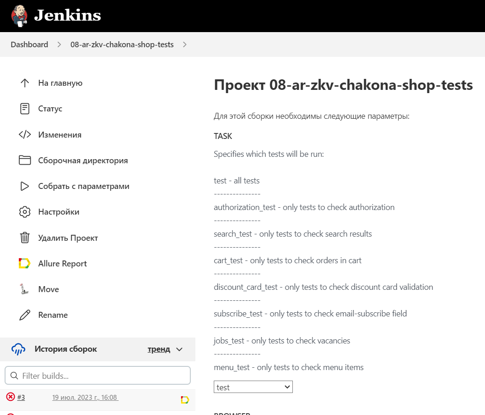
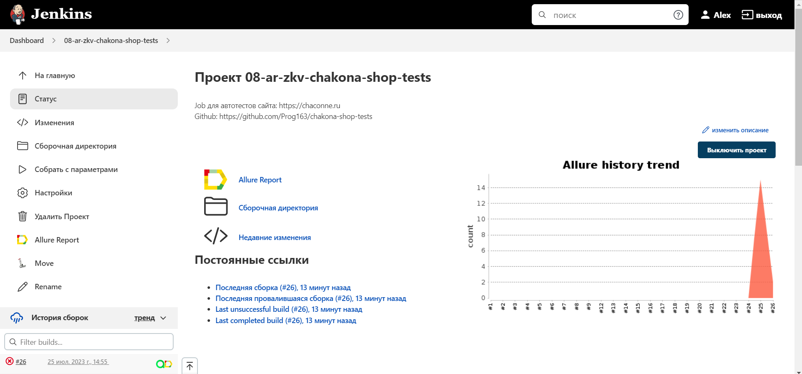
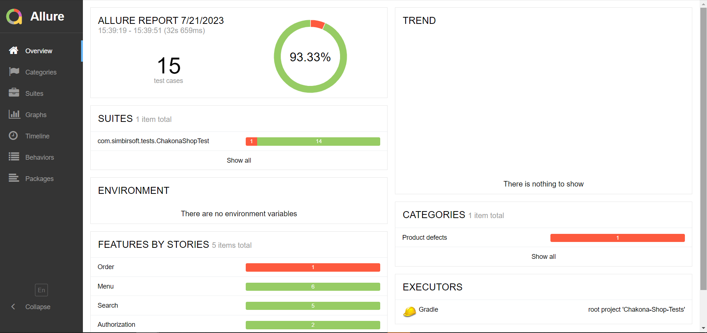
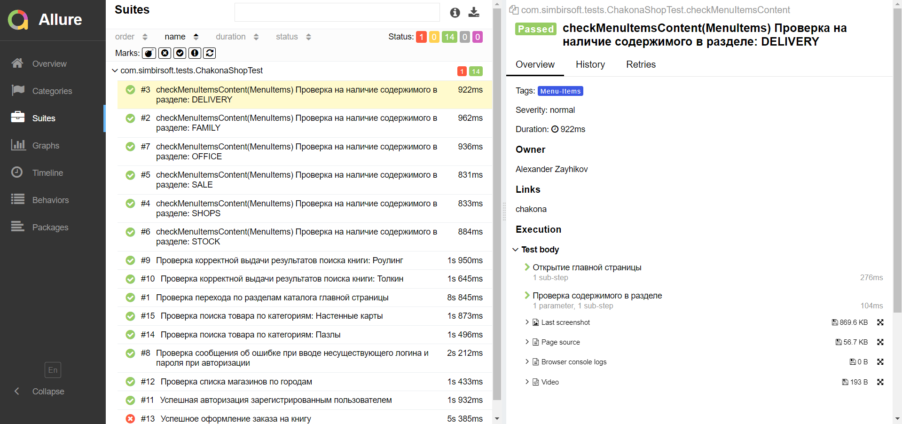
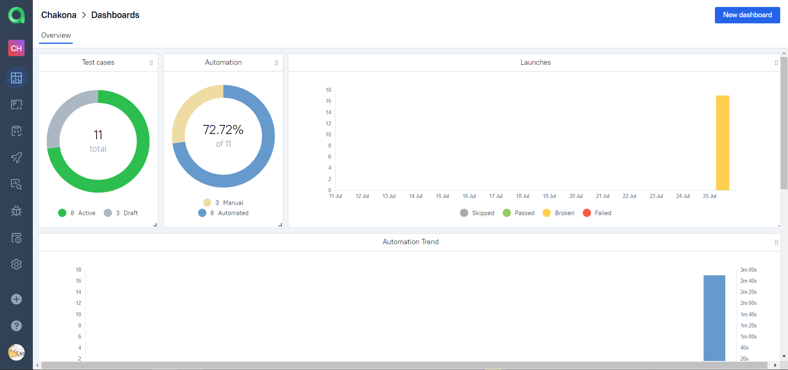
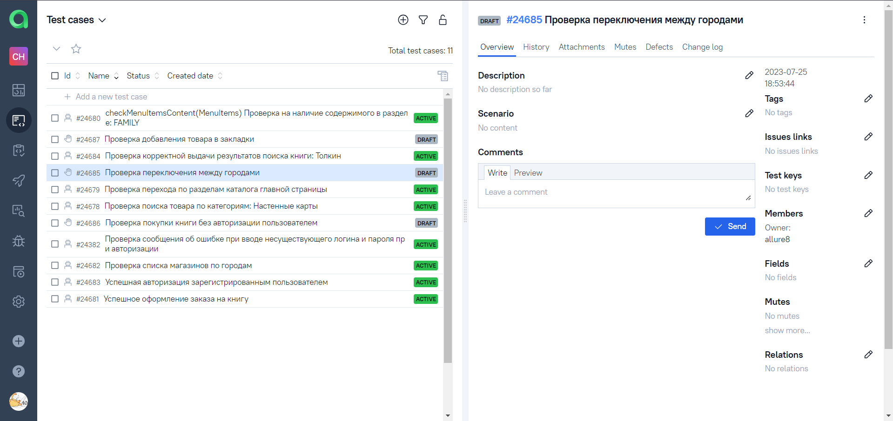
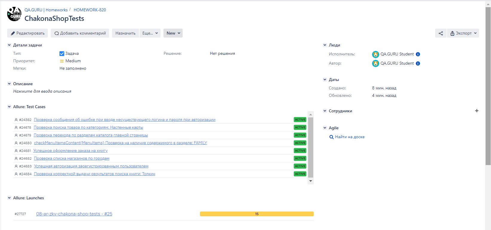

# Chakona-UI-Automation Project
## UI-Automated tests for https://chaconne.ru/

### Used tech stack:
| Java | JUnit5 | Selenide | Gradle | Intelij IDEA | Allure Report | Allure Testops | Jenkins | Selenoid | Jira | Telegram |
|------|--------|----------|--------|--------------|---------------|----------------|---------|----------|------|----------|
||||||||||||

### Launch Parameters:
- TASK (default test)
- BROWSER (default Chrome)
- VERSION (default 100.0)
- SIZE (default 1024*768)
- THREADS (default 1)
- REMOTE_URL (deafult selenoid.autotests.cloud)




### To run tests localy use this command:
```
gradle clean ${your_task} -Dbrowser=${your_browser} -Dversion=${your_version} -Dsize=${your_size} -Dthreads=${your_number_of_threads}
```
### Or run tests, using default settings:
```
gradle clean test
```
##  Jenkins:
### Job overview:


##  Allure Report:
### Overview:


### Tests with steps, attached screenshots, page sources, logs and video:


### Passed test video:


##  Allure Testops:
### Launch:
We can see details for each launch of tests in real-time in TMS Allure Testops


Dashboard



### Test cases:


##  Jira integration:
Test cases and test runs can be integrated to specific issue in Jira



##  Telegram notifications:
After every test run we can get notification with short report


